# 🗺️ ERD DIAGRAM - JOBWEB DATABASE

## 📚 MỤC LỤC

1. [ERD Mermaid Code](#1-erd-mermaid-code)
2. [Hướng dẫn sử dụng](#2-hướng-dẫn-sử-dụng)
3. [Giải thích quan hệ](#3-giải-thích-quan-hệ)
4. [Legend (Chú thích)](#4-legend-chú-thích)

---

## 1. ERD MERMAID CODE

```mermaid
erDiagram
%% Users and Profiles
users ||--o| user_profiles : "has one"
users ||--o{ applications : "creates many"
users ||--o{ saved_jobs : "saves many"
users ||--o{ notifications : "receives many"
users ||--o{ user_company : "manages many"

    %% Companies
    companies ||--o{ company_job : "posts many"
    companies ||--o{ user_company : "managed by many"

    %% Job Listings
    job_listings ||--o{ company_job : "belongs to many"
    job_listings ||--o{ category_job : "belongs to many"
    job_listings ||--o{ applications : "receives many"
    job_listings ||--o{ saved_jobs : "saved by many"

    %% Categories
    categories ||--o{ category_job : "contains many"

    %% Users Table
    users {
        bigint id PK
        string name
        string email UK "unique"
        timestamp email_verified_at
        string password
        enum user_type "admin, company, user"
        string phone
        string avatar
        enum status "active, inactive"
        string remember_token
        timestamp created_at
        timestamp updated_at
    }

    %% User Profiles Table
    user_profiles {
        bigint id PK
        bigint user_id FK "unique, references users"
        string avatar
        date birth_date
        enum gender "male, female, other"
        text address
        text education
        text experience
        text skills
        string cv_file
        text bio
        timestamp created_at
        timestamp updated_at
    }

    %% Companies Table
    companies {
        bigint id PK
        string name
        enum type "Cổ phần, TNHH, Tập đoàn, Khác"
        string size
        string address
        string email
        string phone
        string logo
        text description
        string website
        enum approval_status "pending, approved, rejected"
        enum status "active, inactive"
        timestamp created_at
        timestamp updated_at
    }

    %% Categories Table
    categories {
        bigint id PK
        string name
        string slug UK "unique"
        string icon
        text description
        enum status "active, inactive"
        timestamp created_at
        timestamp updated_at
    }

    %% Job Listings Table
    job_listings {
        bigint id PK
        string title
        string subtitle
        string image
        int applied_count
        int view_count
        decimal salary_min
        decimal salary_max
        enum salary_type "negotiable, range, fixed"
        string position
        string experience
        enum work_type "fulltime, parttime, remote, hybrid"
        date deadline
        text description
        text requirement
        text benefit
        string address
        enum approval_status "pending, approved, rejected"
        enum status "active, inactive"
        timestamp created_at
        timestamp updated_at
    }

    %% Company Job Pivot Table
    company_job {
        bigint id PK
        bigint company_id FK "references companies"
        bigint job_id FK "references job_listings"
        timestamp created_at
        timestamp updated_at
    }

    %% Category Job Pivot Table
    category_job {
        bigint id PK
        bigint category_id FK "references categories"
        bigint job_id FK "references job_listings"
        timestamp created_at
        timestamp updated_at
    }

    %% User Company Pivot Table
    user_company {
        bigint id PK
        bigint user_id FK "references users"
        bigint company_id FK "references companies"
        timestamp created_at
        timestamp updated_at
    }

    %% Applications Table
    applications {
        bigint id PK
        bigint user_id FK "references users"
        bigint job_id FK "references job_listings"
        string cv_file
        text cover_letter
        enum status "pending, reviewed, accepted, rejected"
        timestamp applied_at
        timestamp reviewed_at
        text notes
        timestamp created_at
        timestamp updated_at
    }

    %% Saved Jobs Table
    saved_jobs {
        bigint id PK
        bigint user_id FK "references users"
        bigint job_id FK "references job_listings"
        timestamp created_at
        timestamp updated_at
    }

    %% Notifications Table
    notifications {
        bigint id PK
        bigint user_id FK "references users"
        string title
        text message
        enum type "application, job, system, approval"
        bigint related_id
        boolean is_read
        timestamp created_at
        timestamp updated_at
    }
```



---

## 2. HƯỚNG DẪN SỬ DỤNG

### 📋 Cách hiển thị ERD

#### **Cách 1: Trên GitHub**

````markdown
Tạo file README.md hoặc docs/erd.md, paste code Mermaid vào:

````mermaid
erDiagram
  users ||--o| user_profiles : "has one"
  ...
\```
````
````

GitHub sẽ tự động render ERD diagram! 🎨

#### **Cách 2: Trên Mermaid Live Editor**

1. Truy cập: https://mermaid.live
2. Copy toàn bộ code Mermaid
3. Paste vào editor
4. Tự động render diagram
5. Export PNG/SVG để dùng trong tài liệu

#### **Cách 3: Trên Visual Studio Code**

1. Cài extension: **Markdown Preview Mermaid Support**
2. Tạo file `.md`, paste code Mermaid
3. Mở Preview (Ctrl+Shift+V)

#### **Cách 4: Trên Notion**

1. Gõ `/code`
2. Chọn ngôn ngữ: `Mermaid`
3. Paste code Mermaid
4. Notion sẽ render diagram

---

## 3. GIẢI THÍCH QUAN HỆ

### 🔗 **Ký hiệu quan hệ trong ERD:**

```
||--o|  : One-to-One (1:1)
||--o{  : One-to-Many (1:N)
}o--o{  : Many-to-Many (N:N)

|| : Exactly one (bắt buộc)
|o : Zero or one (tùy chọn)
}o : Zero or many
}{  : One or many
```

---

### 📊 **Chi tiết quan hệ:**

#### **1. users ↔ user_profiles (One-to-One)**

```
users ||--o| user_profiles : "has one"
```

- 1 user có đúng 1 profile
- 1 profile thuộc về 1 user
- Foreign key: `user_profiles.user_id` → `users.id`

---

#### **2. users → applications (One-to-Many)**

```
users ||--o{ applications : "creates many"
```

- 1 user có thể tạo nhiều đơn ứng tuyển
- 1 đơn ứng tuyển thuộc về 1 user
- Foreign key: `applications.user_id` → `users.id`

---

#### **3. users → saved_jobs (One-to-Many)**

```
users ||--o{ saved_jobs : "saves many"
```

- 1 user có thể lưu nhiều job_listings
- 1 saved_job thuộc về 1 user
- Foreign key: `saved_jobs.user_id` → `users.id`

---

#### **4. users → notifications (One-to-Many)**

```
users ||--o{ notifications : "receives many"
```

- 1 user có thể nhận nhiều thông báo
- 1 thông báo gửi cho 1 user
- Foreign key: `notifications.user_id` → `users.id`

---

#### **5. companies ↔ job_listings (Many-to-Many qua company_job)**

```
companies ||--o{ company_job : "posts many"
job_listings ||--o{ company_job : "belongs to many"
```

- 1 company đăng nhiều job_listings
- 1 job_listing có thể thuộc nhiều companies (liên kết tuyển dụng)
- Pivot table: `company_job`

---

#### **6. categories ↔ job_listings (Many-to-Many qua category_job)**

```
categories ||--o{ category_job : "contains many"
job_listings ||--o{ category_job : "belongs to many"
```

- 1 category chứa nhiều job_listings
- 1 job_listing thuộc nhiều categories
- Pivot table: `category_job`

---

#### **7. users ↔ companies (Many-to-Many qua user_company)**

```
users ||--o{ user_company : "manages many"
companies ||--o{ user_company : "managed by many"
```

- 1 user (company role) quản lý nhiều companies
- 1 company có nhiều users quản lý
- Pivot table: `user_company`

---

#### **8. job_listings → applications (One-to-Many)**

```
job_listings ||--o{ applications : "receives many"
```

- 1 job_listing nhận nhiều đơn ứng tuyển
- 1 application thuộc về 1 job_listing
- Foreign key: `applications.job_id` → `job_listings.id`

---

#### **9. job_listings → saved_jobs (One-to-Many)**

```
job_listings ||--o{ saved_jobs : "saved by many"
```

- 1 job_listing được lưu bởi nhiều users
- 1 saved_job thuộc về 1 job_listing
- Foreign key: `saved_jobs.job_id` → `job_listings.id`

---

## 4. LEGEND (CHÚ THÍCH)

### 🔑 **Ký hiệu cột:**

```
PK  : Primary Key (Khóa chính)
FK  : Foreign Key (Khóa ngoại)
UK  : Unique Key (Khóa duy nhất)
```

### 📝 **Kiểu dữ liệu:**

```
bigint      : Số nguyên lớn (ID)
string      : Chuỗi văn bản (VARCHAR)
text        : Văn bản dài (TEXT)
date        : Ngày tháng (DATE)
timestamp   : Ngày giờ (TIMESTAMP)
enum        : Giá trị cố định
decimal     : Số thập phân
int         : Số nguyên
boolean     : Đúng/Sai (true/false)
```

### 🎨 **Màu sắc (khi render):**

Mermaid sẽ tự động tô màu:

- **Bảng chính:** Màu xanh dương
- **Bảng trung gian (pivot):** Màu vàng
- **Foreign key:** Mũi tên liên kết

---

## 5. TỔNG HỢP BẢNG

### 📊 **18 bảng trong hệ thống:**

#### **Laravel mặc định (8 bảng):**

1. `users`
2. `password_reset_tokens`
3. `sessions`
4. `cache`
5. `cache_locks`
6. `jobs` (Laravel Queue)
7. `job_batches` (Laravel Queue)
8. `failed_jobs` (Laravel Queue)

#### **JobWeb (10 bảng):**

9. `user_profiles`
10. `companies`
11. `categories`
12. `job_listings` ⭐
13. `company_job` (Pivot)
14. `category_job` (Pivot)
15. `user_company` (Pivot)
16. `applications`
17. `saved_jobs`
18. `notifications`

---

## 6. QUAN HỆ TỔNG QUAN

```
┌─────────────┐
│   users     │
└──────┬──────┘
       │
       ├─ 1:1 ────► user_profiles
       │
       ├─ 1:N ────► applications ◄──── N:1 ──── job_listings
       │
       ├─ 1:N ────► saved_jobs ◄────────────── job_listings
       │
       ├─ 1:N ────► notifications
       │
       └─ N:N ────► user_company ◄──── N:N ──── companies
                                                      │
                                                      │
                                                      └─ N:N ──► company_job ◄─ N:N ── job_listings
                                                                                            │
                                                                                            │
                                                                                            └─ N:N ──► category_job ◄─ N:N ── categories
```

---

## 7. LƯU Ý QUAN TRỌNG

### ⚠️ **Bảng `jobs` vs `job_listings`:**

```
❌ KHÔNG DÙNG: jobs (dành cho Laravel Queue)
✅ DÙNG: job_listings (bảng tin tuyển dụng)
```

### ⚠️ **Foreign Keys:**

Tất cả foreign key `job_id` trong các bảng sau đều trỏ đến `job_listings.id`:

- `company_job.job_id` → `job_listings.id`
- `category_job.job_id` → `job_listings.id`
- `applications.job_id` → `job_listings.id`
- `saved_jobs.job_id` → `job_listings.id`

### ⚠️ **Unique Constraints:**

```sql
-- 1 user chỉ apply 1 lần cho 1 job
applications: UNIQUE(user_id, job_id)

-- 1 user chỉ lưu 1 lần cho 1 job
saved_jobs: UNIQUE(user_id, job_id)

-- 1 company chỉ liên kết 1 lần với 1 job
company_job: UNIQUE(company_id, job_id)

-- 1 category chỉ liên kết 1 lần với 1 job
category_job: UNIQUE(category_id, job_id)

-- 1 user chỉ quản lý 1 lần cho 1 company
user_company: UNIQUE(user_id, company_id)
```

---

## 8. EXPORT & SHARE

### 📤 **Export diagram:**

#### **PNG/SVG (từ Mermaid Live):**

1. Truy cập https://mermaid.live
2. Paste code Mermaid
3. Click **Actions** → **PNG** hoặc **SVG**
4. Download file

#### **PDF (từ Draw.io):**

1. Truy cập https://app.diagrams.net
2. Import Mermaid code
3. Export PDF

#### **Markdown (cho GitHub):**

````markdown
# ERD Diagram

````mermaid
erDiagram
  users ||--o| user_profiles : "has one"
  ...
\```
````
````

---

## 9. TOOLS KHUYÊN DÙNG

### 🛠️ **ERD Tools:**

1. **Mermaid Live Editor** (Free)

   - Link: https://mermaid.live
   - Render realtime
   - Export PNG/SVG

2. **dbdiagram.io** (Free)

   - Link: https://dbdiagram.io
   - Kéo thả, dễ dùng
   - Export SQL

3. **Draw.io** (Free)

   - Link: https://app.diagrams.net
   - Vẽ ERD chuyên nghiệp
   - Export nhiều format

4. **MySQL Workbench** (Free)

   - Reverse engineer từ database
   - Auto generate ERD

5. **Laravel ER Diagram Generator** (Package)
   ```bash
   composer require beyondcode/laravel-er-diagram-generator --dev
   php artisan generate:erd
   ```

---

## 10. CHECKLIST HOÀN THÀNH

- [x] Tất cả bảng đã được định nghĩa
- [x] Quan hệ One-to-One: `users ↔ user_profiles`
- [x] Quan hệ One-to-Many: `users → applications, saved_jobs, notifications`
- [x] Quan hệ Many-to-Many: `companies ↔ job_listings`, `categories ↔ job_listings`, `users ↔ companies`
- [x] Foreign keys đã được chú thích
- [x] Unique constraints đã được đánh dấu
- [x] Enum values đã được liệt kê
- [x] Timestamps đã có ở tất cả bảng
- [x] Bảng `job_listings` (KHÔNG phải `jobs`)

---

## 🎯 NEXT STEPS

1. ✅ Migrations (Đã xong)
2. ✅ ERD Diagram (File này)
3. ⏭️ Tạo Models với Relationships
4. ⏭️ Tạo Seeders với dữ liệu mẫu
5. ⏭️ Tạo Controllers & Routes

---

## 📞 SUPPORT

Nếu cần:

- Tạo ERD với tools khác
- Export format khác (PDF, PNG, SVG)
- Thêm annotations/notes
- Tạo database schema từ ERD

**Chỉ cần nói là tôi làm ngay!** 🚀
