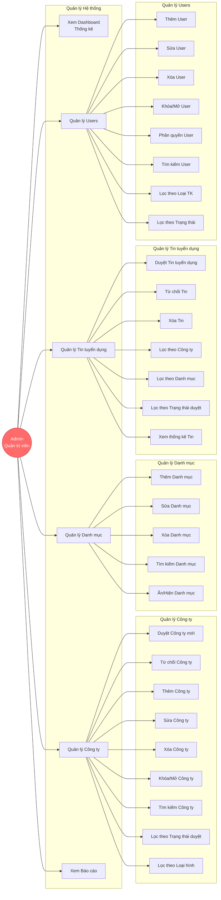
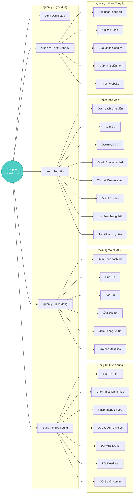
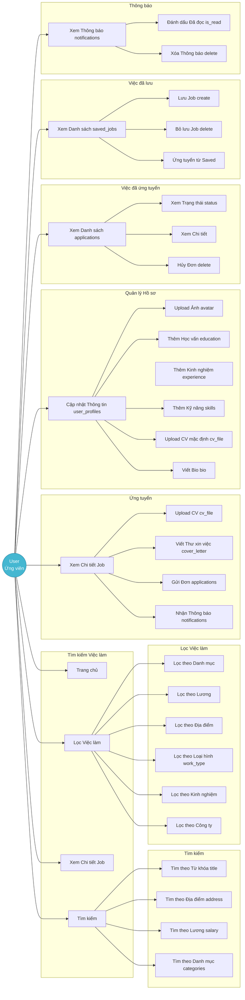
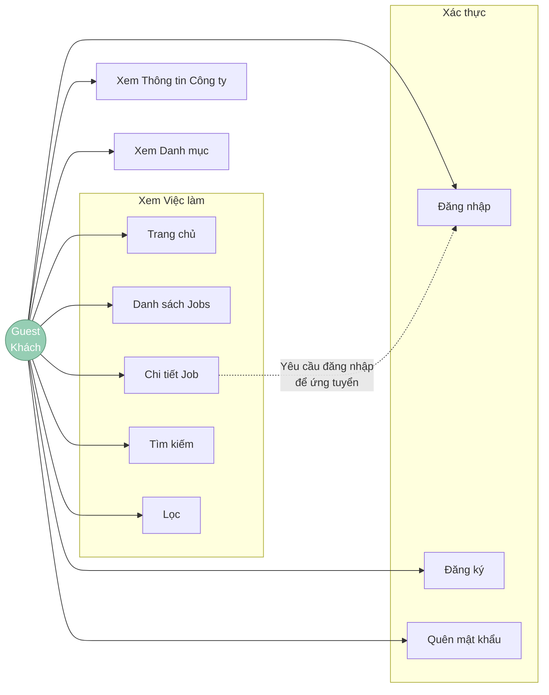

# 🎯 USE CASE DIAGRAMS - JOBWEB (ĐÃ SỬA)

## 📋 MỤC LỤC

1. [Use Case Tổng Quan](#1-use-case-tổng-quan)
2. [Use Case - Admin](#2-use-case---admin)
3. [Use Case - Company](#3-use-case---company)
4. [Use Case - User](#4-use-case---user)
5. [Use Case - Guest](#5-use-case---guest)
6. [Use Case Chi Tiết - Quy Trình Ứng Tuyển](#6-use-case-chi-tiết---quy-trình-ứng-tuyển)
7. [Use Case Chi Tiết - Quy Trình Duyệt](#7-use-case-chi-tiết---quy-trình-duyệt)

---

## 1. USE CASE TỔNG QUAN

```mermaid
graph TB
    subgraph "JobWeb System"
        UC1[Quản lý Công ty]
        UC2[Quản lý Danh mục]
        UC3[Quản lý Tin tuyển dụng]
        UC4[Quản lý Users]
        UC5[Xem Thống kê]
        UC6[Đăng tin tuyển dụng]
        UC7[Xem Ứng viên]
        UC8[Tìm kiếm Việc làm]
        UC9[Ứng tuyển]
        UC10[Quản lý Hồ sơ]
        UC11[Lưu Việc yêu thích]
        UC12[Đăng nhập/Đăng ký]
    end

    Admin((Admin))
    Company((Company))
    User((User))
    Guest((Guest))

    Admin --> UC1
    Admin --> UC2
    Admin --> UC3
    Admin --> UC4
    Admin --> UC5

    Company --> UC6
    Company --> UC7
    Company --> UC10
    Company --> UC12

    User --> UC8
    User --> UC9
    User --> UC10
    User --> UC11
    User --> UC12

    Guest --> UC8
    Guest --> UC12

    style Admin fill:#ff6b6b
    style Company fill:#4ecdc4
    style User fill:#45b7d1
    style Guest fill:#96ceb4
```



**Giải thích:**

- **Admin**: Quản trị toàn bộ hệ thống (công ty, danh mục, tin tuyển dụng, users)
- **Company**: Đăng tin, xem ứng viên, quản lý hồ sơ công ty
- **User**: Tìm việc, ứng tuyển, lưu việc yêu thích, quản lý hồ sơ cá nhân
- **Guest**: Chỉ xem việc làm, phải đăng nhập để ứng tuyển

---

## 2. USE CASE - ADMIN



**Chi tiết chức năng Admin:**

### 📊 Dashboard & Thống kê

- Tổng số công ty (pending/approved/rejected)
- Tổng số tin tuyển dụng (pending/approved/rejected/active)
- Tổng số users (admin/company/user)
- Tổng số đơn ứng tuyển
- Biểu đồ theo thời gian

### 🏢 Quản lý Công ty

- **Duyệt công ty**: Từ `pending` → `approved`
- **Từ chối công ty**: Từ `pending` → `rejected`
- **Khóa/Mở công ty**: Thay đổi `status` (active/inactive)
- **CRUD công ty**: Thêm, sửa, xóa công ty
- **Tìm kiếm & lọc**: Theo tên, loại hình, trạng thái

### 📁 Quản lý Danh mục

- **CRUD danh mục**: Thêm, sửa, xóa danh mục
- **Ẩn/Hiện danh mục**: Thay đổi `status` (active/inactive)
- Danh mục ví dụ: IT - Phần mềm, Marketing, Kinh doanh, Backend, Frontend

### 📰 Quản lý Tin tuyển dụng (job_listings)

- **Duyệt tin**: Từ `pending` → `approved`
- **Từ chối tin**: Từ `pending` → `rejected`
- **Xóa tin**: Xóa tin vi phạm
- **Lọc & tìm kiếm**: Theo công ty, danh mục, trạng thái

### 👥 Quản lý Users

- **CRUD users**: Thêm, sửa, xóa user
- **Phân quyền**: admin, company, user
- **Khóa/Mở user**: Thay đổi `status` (active/inactive)
- **Lọc**: Theo user_type, status

---

## 3. USE CASE - COMPANY



**Chi tiết chức năng Company:**

### 📊 Dashboard Company

- Tổng số tin đã đăng
- Tổng số ứng viên (pending/reviewed/accepted/rejected)
- Tin hot nhất (nhiều lượt xem/ứng tuyển)
- Thông báo mới

### 📰 Đăng Tin tuyển dụng (job_listings)

1. **Tạo tin mới**:
   - Nhập: title, subtitle, description, requirement, benefit
   - Upload: image (ảnh đại diện)
   - Chọn: nhiều categories (qua bảng category_job)
   - Đặt: salary_min, salary_max, salary_type
   - Chọn: work_type (fulltime/parttime/remote/hybrid)
   - Nhập: position, experience, address, deadline
2. **Gửi duyệt**: `approval_status = pending` → Admin duyệt

### 📋 Quản lý Tin đã đăng

- **Xem danh sách**: Lọc theo trạng thái (pending/approved/rejected/active/inactive)
- **Sửa tin**: Chỉnh sửa thông tin (phải duyệt lại nếu cần)
- **Ẩn/Hiện tin**: Thay đổi `status` (active/inactive)
- **Thống kê**: Xem `view_count`, `applied_count`
- **Gia hạn deadline**: Cập nhật deadline mới

### 👥 Xem Ứng viên (applications)

- **Danh sách ứng viên**: Tất cả ứng viên đã apply vào job của company
- **Xem CV**: Xem file `cv_file` của ứng viên
- **Download CV**: Tải CV về
- **Duyệt đơn**:
  - Chấp nhận: `status = accepted` → Gửi notification cho user
  - Từ chối: `status = rejected` → Gửi notification cho user
  - Đánh dấu đã xem: `reviewed_at = now()` → Gửi notification cho user
- **Ghi chú**: Thêm `notes` cho ứng viên
- **Lọc**: Theo status (pending/reviewed/accepted/rejected)

### 🏢 Quản lý Hồ sơ Công ty (companies)

- Cập nhật: name, type, size, address, email, phone
- Upload: logo
- Sửa: description (giới thiệu công ty)
- Thêm: website

---

## 4. USE CASE - USER



**Chi tiết chức năng User:**

### 🔍 Tìm kiếm Việc làm (job_listings)

1. **Tìm kiếm**:

   - Theo từ khóa: `title LIKE '%keyword%'`
   - Theo địa điểm: `address LIKE '%location%'`
   - Theo lương: `salary_min >= X AND salary_max <= Y`
   - Theo danh mục: `categories.id IN (1,2,3)`

2. **Lọc**:
   - Theo danh mục (categories)
   - Theo lương (salary_min, salary_max)
   - Theo địa điểm (address)
   - Theo loại hình (work_type: fulltime/parttime/remote/hybrid)
   - Theo kinh nghiệm (experience)
   - Theo công ty (companies)

### 📝 Ứng tuyển (applications)

1. **Xem chi tiết job**:
   - Thông tin job_listing đầy đủ
   - Thông tin công ty (companies)
   - Danh mục (categories)
2. **Ứng tuyển**:
   - Upload CV (hoặc dùng CV mặc định từ user_profiles)
   - Viết thư xin việc (cover_letter)
   - Gửi đơn → Tạo record trong `applications`
   - Kiểm tra: 1 user chỉ apply 1 lần cho 1 job (UNIQUE constraint)
   - Tăng `applied_count` của job_listing
   - Gửi notification cho company

### 👤 Quản lý Hồ sơ (user_profiles)

- Cập nhật: avatar, birth_date, gender, address
- Thêm: education (học vấn)
- Thêm: experience (kinh nghiệm làm việc)
- Thêm: skills (kỹ năng)
- Upload: cv_file (CV mặc định)
- Viết: bio (giới thiệu bản thân)

### 📋 Việc đã ứng tuyển (applications)

- Xem danh sách: Tất cả job đã apply
- Xem trạng thái: pending/reviewed/accepted/rejected
- Xem chi tiết: Thông tin job, company, CV đã gửi
- Hủy đơn: Xóa application (nếu status = pending)

### ⭐ Việc đã lưu (saved_jobs)

- Lưu job: Tạo record trong `saved_jobs`
- Bỏ lưu: Xóa record
- Ứng tuyển: Từ danh sách saved → Chuyển sang form ứng tuyển
- Kiểm tra: 1 user chỉ lưu 1 lần cho 1 job (UNIQUE constraint)

### 🔔 Thông báo (notifications)

- **Loại thông báo** (type):
  - `application`: Liên quan đơn ứng tuyển (đã xem CV, chấp nhận, từ chối)
  - `job`: Việc làm mới phù hợp
  - `system`: Hệ thống
  - `approval`: Duyệt/từ chối
- Đánh dấu đã đọc: `is_read = true`
- Xóa thông báo: Delete record

---

## 5. USE CASE - GUEST



**Chi tiết chức năng Guest:**

### 👀 Xem Việc làm (Không cần đăng nhập)

- Xem trang chủ
- Xem danh sách job_listings (chỉ `approval_status=approved`, `status=active`)
- Xem chi tiết job
- Tìm kiếm & lọc job
- Xem thông tin công ty
- Xem danh mục

### 🔒 Hành động bị giới hạn

- **Không thể**: Ứng tuyển, lưu job, xem thông báo
- **Phải đăng nhập**: Redirect sang trang login khi click "Ứng tuyển" hoặc "Lưu việc"

### 🔑 Xác thực

- **Đăng ký**: Tạo user mới (user_type = 'user')
- **Đăng nhập**: Laravel Breeze
- **Quên mật khẩu**: Reset password

---

## 6. USE CASE CHI TIẾT - QUY TRÌNH ỨNG TUYỂN

```mermaid
sequenceDiagram
    actor User as 👤 User
    actor Company as 🏢 Company
    actor System as ⚙️ System

    Note over User,System: GIAI ĐOẠN 1: TÌM KIẾM VIỆC LÀM

    User->>System: 1. Truy cập trang chủ
    System->>System: Query: job_listings WHERE<br/>approval_status=approved<br/>AND status=active<br/>AND deadline >= now()
    System->>User: Hiển thị danh sách jobs

    User->>System: 2. Tìm kiếm "PHP Developer"
    System->>System: Query: WHERE title LIKE '%PHP%'
    System->>User: Hiển thị kết quả lọc

    User->>System: 3. Lọc theo lương 15-20tr, HN
    System->>System: WHERE salary_min >= 15<br/>AND salary_max <= 20<br/>AND address LIKE '%HN%'
    System->>User: Hiển thị jobs phù hợp

    User->>System: 4. Click vào job_listing chi tiết
    System->>System: Tăng view_count + 1
    System->>System: Query job WITH companies, categories
    System->>User: Hiển thị thông tin đầy đủ

    Note over User,System: GIAI ĐOẠN 2: LƯU VIỆC YÊU THÍCH

    User->>System: 5. Click "Lưu việc" ⭐
    System->>System: Check: saved_jobs WHERE<br/>user_id=X AND job_id=Y

    alt Chưa lưu
        System->>System: INSERT INTO saved_jobs<br/>(user_id, job_id)
        System->>User: ✅ "Đã lưu việc thành công"
    else Đã lưu rồi
        System->>User: ℹ️ "Bạn đã lưu việc này rồi"
    end

    Note over User,System: GIAI ĐOẠN 3: ỨNG TUYỂN

    User->>System: 6. Click "Ứng tuyển" 📝
    System->>System: Check: Đã đăng nhập?

    alt Chưa đăng nhập
        System->>User: Redirect: /login
    else Đã đăng nhập
        System->>User: Hiển thị form ứng tuyển
    end

    User->>System: 7. Upload CV (cv_file)
    User->>System: 8. Viết thư xin việc (cover_letter)
    User->>System: 9. Click "Gửi đơn"

    System->>System: Check: applications WHERE<br/>user_id=X AND job_id=Y

    alt Chưa apply
        System->>System: INSERT INTO applications<br/>(user_id, job_id, cv_file,<br/>cover_letter, status=pending)
        System->>System: UPDATE job_listings<br/>SET applied_count = applied_count + 1
        System->>User: ✅ "Ứng tuyển thành công"
        System->>System: INSERT INTO notifications<br/>(user_id=company_user,<br/>type=application,<br/>message="Có ứng viên mới")
        System->>Company: 🔔 "Có ứng viên mới: [User Name]"
    else Đã apply rồi
        System->>User: ❌ "Bạn đã ứng tuyển job này rồi"
    end

    Note over User,Company: GIAI ĐOẠN 4: COMPANY XEM ỨNG VIÊN

    Company->>System: 10. Vào "Danh sách ứng viên"
    System->>System: Query: applications WHERE<br/>job_id IN (company's jobs)
    System->>Company: Hiển thị danh sách applications

    Company->>System: 11. Xem CV của User
    System->>System: UPDATE applications<br/>SET reviewed_at = now()
    System->>System: INSERT INTO notifications<br/>(user_id=applicant,<br/>type=application,<br/>message="[Company] đã xem CV")
    System->>User: 🔔 "[Company Name] đã xem CV của bạn"

    Company->>System: 12. Download CV
    System->>Company: Download: cv_file

    Note over User,Company: GIAI ĐOẠN 5: DUYỆT ĐƠN

    alt Chấp nhận ✅
        Company->>System: 13. Click "Chấp nhận"
        System->>System: UPDATE applications<br/>SET status = 'accepted'
        System->>System: INSERT INTO notifications<br/>(type=application,<br/>message="Chúc mừng! Đã chấp nhận")
        System->>User: 🎉 "Chúc mừng! [Company] đã chấp nhận đơn của bạn"
    else Từ chối ❌
        Company->>System: 13. Click "Từ chối" + Lý do
        System->>System: UPDATE applications<br/>SET status = 'rejected',<br/>notes = '[Lý do]'
        System->>System: INSERT INTO notifications<br/>(type=application,<br/>message="Rất tiếc...")
        System->>User: 😔 "Rất tiếc, [Company] chưa phù hợp lúc này"
    end

    Note over User,Company: GIAI ĐOẠN 6: XEM LỊCH SỬ

    User->>System: 14. Vào "Việc đã ứng tuyển"
    System->>System: Query: applications WHERE<br/>user_id = X<br/>WITH job_listings, companies
    System->>User: Hiển thị danh sách applications

    User->>System: 15. Xem trạng thái đơn
    System->>User: Hiển thị status:<br/>✋ pending (Chờ xét duyệt)<br/>👀 reviewed (Đã xem CV)<br/>✅ accepted (Đã chấp nhận)<br/>❌ rejected (Đã từ chối)
```



**Giải thích chi tiết các bước:**

### GIAI ĐOẠN 1: TÌM KIẾM VIỆC LÀM

**Bước 1-2: Tìm kiếm cơ bản**

```sql
-- Query jobs hiển thị trên trang chủ
SELECT * FROM job_listings
WHERE approval_status = 'approved'
AND status = 'active'
AND deadline >= CURDATE()
ORDER BY created_at DESC;

-- Tìm kiếm theo từ khóa
WHERE title LIKE '%PHP%' OR description LIKE '%PHP%'
```

**Bước 3: Lọc nâng cao**

```sql
-- Lọc theo lương và địa điểm
WHERE salary_min >= 15
AND salary_max <= 20
AND address LIKE '%Hà Nội%'
```

**Bước 4: Tăng view_count**

```sql
-- Mỗi lần xem chi tiết job
UPDATE job_listings
SET view_count = view_count + 1
WHERE id = ?;
```

### GIAI ĐOẠN 2: LƯU VIỆC YÊU THÍCH

**Bước 5: Lưu job vào saved_jobs**

```sql
-- Check xem đã lưu chưa
SELECT * FROM saved_jobs
WHERE user_id = ? AND job_id = ?;

-- Nếu chưa lưu thì INSERT
INSERT INTO saved_jobs (user_id, job_id)
VALUES (?, ?);

-- UNIQUE constraint đảm bảo không trùng:
-- UNIQUE KEY (user_id, job_id)
```

### GIAI ĐOẠN 3: ỨNG TUYỂN

**Bước 6-9: Quy trình ứng tuyển**

```sql
-- Check đã apply chưa
SELECT * FROM applications
WHERE user_id = ? AND job_id = ?;

-- Nếu chưa apply thì INSERT
INSERT INTO applications (
    user_id,
    job_id,
    cv_file,
    cover_letter,
    status,
    applied_at
) VALUES (?, ?, ?, ?, 'pending', NOW());

-- Tăng applied_count
UPDATE job_listings
SET applied_count = applied_count + 1
WHERE id = ?;

-- Tạo notification cho company
INSERT INTO notifications (
    user_id, -- ID của HR/Company
    title,
    message,
    type,
    related_id -- application_id
) VALUES (?, 'Có ứng viên mới', '...', 'application', ?);
```

### GIAI ĐOẠN 4: COMPANY XEM ỨNG VIÊN

**Bước 10-11: Xem danh sách ứng viên**

```sql
-- Lấy danh sách ứng viên của company
SELECT applications.*, users.name, users.email
FROM applications
JOIN job_listings ON applications.job_id = job_listings.id
JOIN company_job ON job_listings.id = company_job.job_id
WHERE company_job.company_id = ?
ORDER BY applications.applied_at DESC;

-- Khi HR xem CV, update reviewed_at
UPDATE applications
SET reviewed_at = NOW()
WHERE id = ?;

-- Gửi notification cho user
INSERT INTO notifications (
    user_id, -- ID của ứng viên
    title,
    message,
    type
) VALUES (?, 'CV đã được xem', '...', 'application');
```

### GIAI ĐOẠN 5: DUYỆT ĐƠN

**Bước 13: Chấp nhận/Từ chối**

```sql
-- Chấp nhận đơn
UPDATE applications
SET status = 'accepted'
WHERE id = ?;

-- Từ chối đơn + ghi chú
UPDATE applications
SET status = 'rejected',
    notes = 'Lý do từ chối...'
WHERE id = ?;

-- Gửi notification
INSERT INTO notifications (...);
```

---

## 7. USE CASE CHI TIẾT - QUY TRÌNH DUYỆT

```mermaid
sequenceDiagram
    actor Company as 🏢 Company
    actor Admin as 👑 Admin
    actor System as ⚙️ System
    actor User as 👤 User

    Note over Company,System: QUY TRÌNH 1: DUYỆT CÔNG TY

    Company->>System: 1. Đăng ký tài khoản Company
    System->>System: INSERT INTO users<br/>(name, email, password,<br/>user_type='company',<br/>status='active')
    System->>System: INSERT INTO companies<br/>(name, type, ...,<br/>approval_status='pending',<br/>status='active')
    System->>System: INSERT INTO user_company<br/>(user_id, company_id)
    System->>System: INSERT INTO notifications<br/>(user_id=admin,<br/>type='approval',<br/>message='Có công ty mới')
    System->>Admin: 🔔 "Có công ty mới đăng ký: [Company Name]"

    Admin->>System: 2. Vào "Quản lý Công ty"
    System->>System: Query: companies WHERE<br/>approval_status='pending'
    System->>Admin: Hiển thị danh sách công ty chờ duyệt

    Admin->>System: 3. Xem thông tin Company
    System->>System: Query: companies WITH users
    System->>Admin: Hiển thị chi tiết công ty

    alt Chấp nhận ✅
        Admin->>System: 4a. Click "Duyệt"
        System->>System: UPDATE companies<br/>SET approval_status = 'approved'<br/>WHERE id = ?
        System->>System: INSERT INTO notifications<br/>(user_id=company_user,<br/>type='approval',<br/>message='Công ty đã được duyệt')
        System->>Company: 🎉 "Công ty đã được duyệt! Bạn có thể đăng tin tuyển dụng"
    else Từ chối ❌
        Admin->>System: 4b. Click "Từ chối" + Lý do
        System->>System: UPDATE companies<br/>SET approval_status = 'rejected'<br/>WHERE id = ?
        System->>System: INSERT INTO notifications<br/>(user_id=company_user,<br/>type='approval',<br/>message='Công ty bị từ chối. Lý do: ...')
        System->>Company: ❌ "Công ty bị từ chối. Lý do: [Chi tiết]"
    end

    Note over Company,System: QUY TRÌNH 2: DUYỆT TIN TUYỂN DỤNG

    Company->>System: 5. Đăng tin tuyển dụng
    System->>System: Check: Company approval_status = 'approved'?

    alt Company đã được duyệt
        System->>System: INSERT INTO job_listings<br/>(title, description, ...,<br/>approval_status='pending',<br/>status='active')
        System->>System: INSERT INTO company_job<br/>(company_id, job_id)
        System->>System: INSERT INTO category_job<br/>(category_id, job_id)<br/>FOR EACH selected category
        System->>System: INSERT INTO notifications<br/>(user_id=admin,<br/>type='approval',<br/>message='Tin tuyển dụng mới')
        System->>Admin: 🔔 "Tin tuyển dụng mới: [Job Title] từ [Company]"
    else Company chưa được duyệt
        System->>Company: ⚠️ "Công ty chưa được duyệt. Vui lòng chờ Admin duyệt"
    end

    Admin->>System: 6. Vào "Quản lý Tin tuyển dụng"
    System->>System: Query: job_listings WHERE<br/>approval_status='pending'<br/>WITH companies, categories
    System->>Admin: Hiển thị danh sách tin chờ duyệt

    Admin->>System: 7. Xem chi tiết tin
    System->>System: Query: job_listings WITH<br/>companies, categories
    System->>Admin: Hiển thị thông tin job đầy đủ

    alt Chấp nhận ✅
        Admin->>System: 8a. Click "Duyệt"
        System->>System: UPDATE job_listings<br/>SET approval_status = 'approved'<br/>WHERE id = ?
        System->>System: Tin này hiện trên trang chủ<br/>(approval_status='approved'<br/>AND status='active')
        System->>System: INSERT INTO notifications<br/>(user_id=company_user,<br/>type='approval',<br/>message='Tin đã được duyệt')
        System->>Company: ✅ "Tin tuyển dụng '[Job Title]' đã được duyệt"

        Note over User,System: Tin xuất hiện trên trang chủ
        System->>User: Hiển thị job mới trên trang chủ

    else Từ chối ❌
        Admin->>System: 8b. Click "Từ chối" + Lý do
        System->>System: UPDATE job_listings<br/>SET approval_status = 'rejected'<br/>WHERE id = ?
        System->>System: INSERT INTO notifications<br/>(user_id=company_user,<br/>type='approval',<br/>message='Tin bị từ chối. Lý do: ...')
        System->>Company: ❌ "Tin '[Job Title]' bị từ chối. Lý do: [Chi tiết]"
    end

    Note over Company,System: QUY TRÌNH 3: COMPANY SỬA TIN

    Company->>System: 9. Sửa tin đã đăng
    System->>System: UPDATE job_listings<br/>SET ... ,<br/>approval_status='pending'<br/>WHERE id = ?
    System->>Admin: 🔔 "Tin '[Job Title]' đã được chỉnh sửa, cần duyệt lại"

    Note right of System: Tin bị ẩn cho đến khi<br/>Admin duyệt lại

    Admin->>System: 10. Duyệt lại tin đã sửa
    System->>System: UPDATE approval_status = 'approved'
    System->>Company: ✅ "Tin đã được duyệt lại"
```



**Giải thích chi tiết quy trình duyệt:**

### QUY TRÌNH 1: DUYỆT CÔNG TY

**Bước 1: Đăng ký Company**

```sql
-- Tạo user với user_type = 'company'
INSERT INTO users (name, email, password, user_type, status)
VALUES (?, ?, ?, 'company', 'active');

-- Tạo company với approval_status = 'pending'
INSERT INTO companies (
    name, type, address, email, phone,
    approval_status, status
) VALUES (?, ?, ?, ?, ?, 'pending', 'active');

-- Liên kết user với company
INSERT INTO user_company (user_id, company_id)
VALUES (?, ?);

-- Thông báo cho Admin
INSERT INTO notifications (
    user_id, -- Admin user_id
    title,
    message,
    type,
    related_id -- company_id
) VALUES (?, 'Công ty mới', 'Có công ty mới đăng ký...', 'approval', ?);
```

**Bước 2-4: Admin duyệt công ty**

```sql
-- Admin xem danh sách công ty chờ duyệt
SELECT * FROM companies
WHERE approval_status = 'pending'
ORDER BY created_at DESC;

-- Duyệt công ty
UPDATE companies
SET approval_status = 'approved'
WHERE id = ?;

-- Từ chối công ty
UPDATE companies
SET approval_status = 'rejected'
WHERE id = ?;

-- Gửi notification cho company
INSERT INTO notifications (
    user_id, -- Company user_id
    title,
    message,
    type
) VALUES (?, 'Kết quả duyệt', '...', 'approval');
```

### QUY TRÌNH 2: DUYỆT TIN TUYỂN DỤNG

**Bước 5: Company đăng tin**

```sql
-- Check company đã được duyệt chưa
SELECT approval_status FROM companies WHERE id = ?;

-- Nếu approved thì cho phép đăng tin
INSERT INTO job_listings (
    title, subtitle, description, requirement, benefit,
    salary_min, salary_max, salary_type,
    position, experience, work_type,
    deadline, address, image,
    approval_status, status
) VALUES (..., 'pending', 'active');

-- Liên kết với company
INSERT INTO company_job (company_id, job_id)
VALUES (?, ?);

-- Liên kết với nhiều categories
INSERT INTO category_job (category_id, job_id)
VALUES (1, ?), (2, ?), (3, ?);

-- Thông báo cho Admin
INSERT INTO notifications (
    user_id, -- Admin
    title,
    message,
    type,
    related_id -- job_id
) VALUES (?, 'Tin tuyển dụng mới', '...', 'approval', ?);
```

**Bước 6-8: Admin duyệt tin**

```sql
-- Admin xem danh sách tin chờ duyệt
SELECT job_listings.*, companies.name as company_name
FROM job_listings
JOIN company_job ON job_listings.id = company_job.job_id
JOIN companies ON company_job.company_id = companies.id
WHERE job_listings.approval_status = 'pending'
ORDER BY job_listings.created_at DESC;

-- Duyệt tin
UPDATE job_listings
SET approval_status = 'approved'
WHERE id = ?;

-- Tin này sẽ hiển thị trên trang chủ
-- Điều kiện: approval_status='approved' AND status='active' AND deadline >= now()

-- Từ chối tin
UPDATE job_listings
SET approval_status = 'rejected'
WHERE id = ?;

-- Gửi notification cho company
INSERT INTO notifications (
    user_id, -- Company user_id
    title,
    message,
    type
) VALUES (?, 'Kết quả duyệt tin', '...', 'approval');
```

### QUY TRÌNH 3: SỬA TIN ĐÃ ĐĂNG

**Bước 9-10: Sửa tin cần duyệt lại**

```sql
-- Khi company sửa tin, chuyển về pending
UPDATE job_listings
SET
    title = ?,
    description = ?,
    ...,
    approval_status = 'pending', -- Phải duyệt lại
    updated_at = NOW()
WHERE id = ?;

-- Tin sẽ bị ẩn cho đến khi Admin duyệt lại
-- Không hiển thị trên trang chủ (approval_status != 'approved')

-- Thông báo cho Admin
INSERT INTO notifications (
    user_id, -- Admin
    title,
    message,
    type,
    related_id
) VALUES (?, 'Tin đã sửa', 'Tin [title] cần duyệt lại', 'approval', ?);
```

---

## 📊 THỐNG KÊ USE CASES

### 👑 Admin: 45+ Use Cases

| Chức năng              | Số Use Cases |
| ---------------------- | ------------ |
| Quản lý Công ty        | 9 cases      |
| Quản lý Danh mục       | 5 cases      |
| Quản lý Tin tuyển dụng | 7 cases      |
| Quản lý Users          | 8 cases      |
| Dashboard & Reports    | 10+ cases    |
| Quy trình Duyệt        | 6+ cases     |

### 🏢 Company: 35+ Use Cases

| Chức năng              | Số Use Cases |
| ---------------------- | ------------ |
| Đăng tin tuyển dụng    | 7 cases      |
| Quản lý tin đã đăng    | 6 cases      |
| Xem & Quản lý ứng viên | 8 cases      |
| Quản lý hồ sơ công ty  | 5 cases      |
| Dashboard              | 5+ cases     |
| Thông báo              | 4+ cases     |

### 👤 User: 40+ Use Cases

| Chức năng              | Số Use Cases |
| ---------------------- | ------------ |
| Tìm kiếm & Lọc         | 10 cases     |
| Ứng tuyển              | 4 cases      |
| Quản lý hồ sơ cá nhân  | 6 cases      |
| Việc đã ứng tuyển      | 3 cases      |
| Việc đã lưu            | 3 cases      |
| Thông báo              | 2 cases      |
| Xem công ty & danh mục | 5+ cases     |
| Khác                   | 7+ cases     |

### 👀 Guest: 12 Use Cases

| Chức năng      | Số Use Cases |
| -------------- | ------------ |
| Xem jobs       | 5 cases      |
| Tìm kiếm & Lọc | 5 cases      |
| Xác thực       | 3 cases      |

---

## 🎯 QUAN HỆ GIỮA CÁC BẢNG TRONG USE CASES

### Use Case: Ứng tuyển

```
User → applications → job_listings → companies
                   → job_listings → categories
```

### Use Case: Company xem ứng viên

```
Company → company_job → job_listings → applications → users → user_profiles
```

### Use Case: Admin duyệt tin

```
Admin → job_listings → company_job → companies
                    → category_job → categories
```

### Use Case: Tìm kiếm

```
User → job_listings → categories (qua category_job)
                   → companies (qua company_job)
```

---

## ✅ CHECKLIST HOÀN THÀNH

- [x] Use Case Tổng quan - 4 actors
- [x] Use Case Admin - 45+ cases
- [x] Use Case Company - 35+ cases
- [x] Use Case User - 40+ cases
- [x] Use Case Guest - 12 cases
- [x] Sequence Diagram - Quy trình Ứng tuyển
- [x] Sequence Diagram - Quy trình Duyệt
- [x] SQL queries chi tiết
- [x] Giải thích từng bước
- [x] Liên kết với database schema

---

## 🎉 HOÀN TẤT!

Tất cả Use Cases đã được viết lại dựa trên cấu trúc database từ file 01-04!

**Các điểm chính:**

- ✅ Sử dụng đúng tên bảng `job_listings` (không phải `jobs`)
- ✅ Foreign keys chính xác
- ✅ Có SQL queries minh họa
- ✅ Sequence diagrams chi tiết
- ✅ Giải thích rõ ràng từng bước

Bạn có thể copy code Mermaid vào GitHub/Notion/GitLab để render diagram! 🚀
